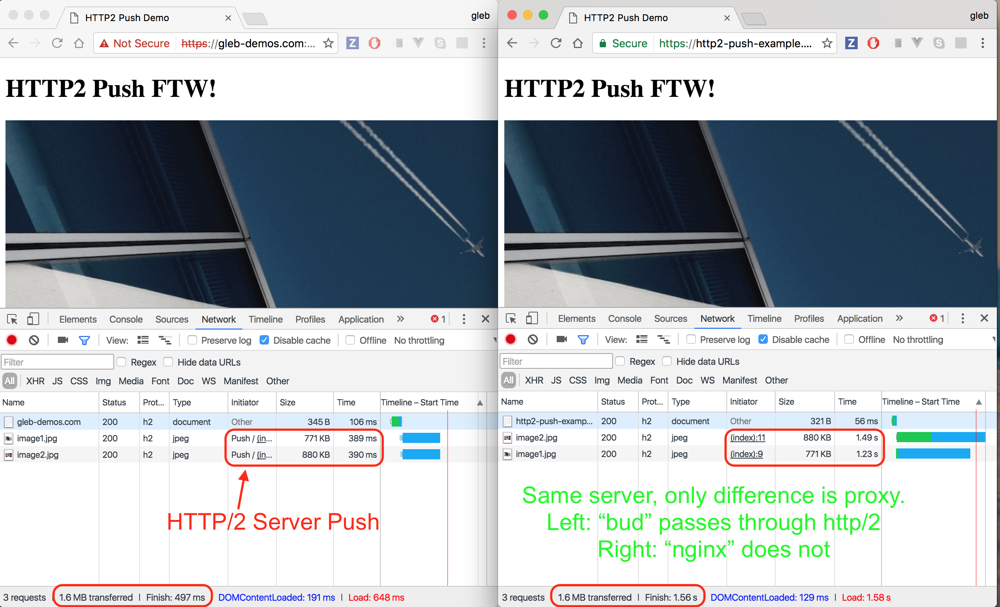

# http2-push-example

> Example server showing HTTP/2 Push for Zeit deploy

See blog post
[GETTING STARTED WITH HTTP/2 AND SERVER PUSH](https://deanhume.com/Home/BlogPost/getting-started-with-http-2-and-server-push/10152)

## Result

Same HTTP2 Node server using [spdy](https://github.com/indutny/node-spdy)
and TLS terminator proxy [bud](https://github.com/indutny/bud) - thanks to
[Fedor Indutny](https://github.com/indutny) for writing both - this combo
has server push available and can stream the images in the page much much
faster to the client.

On the right, same server, but NGINX proxy, which does not implement
HTTP/2 proxying, see [issue](https://trac.nginx.org/nginx/ticket/923).
Thus the server cannot push images in the same stream to the client.

